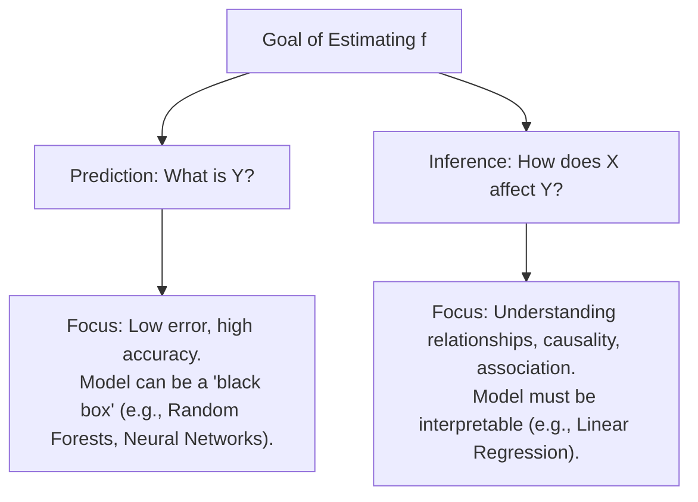

# ISLP Chapter 2: Statistical Learning — Study Guide & Synthesis

This study guide covers the core concepts of **Chapter 2 of *An Introduction to Statistical Learning with Applications in Python* (ISLP)**. It aligns with the "Visuals/Code First, Math Second" philosophy, explaining the mathematical foundations conceptually and visually.

---

## 1. The Core Paradigm: Y = f(X) + ε

At the heart of statistical learning is the assumption that there is a relationship between some set of inputs (predictors/features X) and an output (response Y):

```
Y = f(X) + ε
```

Where:
* **X = (X₁, X₂, ..., Xₚ)**: Predictors (independent variables, features).
* **Y**: The response (dependent variable, target).
* **f(X)**: The systematic information that X provides about Y. This is the "true rule" we want to estimate.
* **ε (Epsilon)**: The **Irreducible Error** (noise). It represents all unmeasured variables, random fluctuations, and measurement errors. By definition, expectation E[ε] = 0 and ε is independent of X.

---

## 2. Why Estimate f(X)?

We estimate the function f for two main reasons: **Prediction** and **Inference**.



| Dimension | Prediction | Inference |
| :--- | :--- | :--- |
| **Primary Question** | "What is the expected value of Y given a new observation X = x?" | "Which features are associated with Y? Is the relationship linear?" |
| **Model Requirements** | Accuracy is paramount. Interpretability is secondary. | Interpretability is essential. Simple, clear models are preferred. |
| **Example** | Predicting whether a transaction is fraudulent. | Identifying if advertising on TV vs. Radio increases sales more. |

---

## 3. How Do We Estimate f(X)?

We use a set of training data to train our model f̂(X) (read as "f-hat of X"). The methods fall into two main families:

### A. Parametric Methods (Assumptions First)
1. **The Step**: We assume a specific mathematical shape/form for f(X) (e.g., linear: f(X) = β₀ + β₁X₁ + β₂X₂).
2. **The Fit**: We use the training data to estimate the parameters (β₀, β₁, β₂).
* **Pros**: Simple to fit, requires less training data, highly interpretable.
* **Cons**: If our assumption about the shape is wrong, the model will have high bias and perform poorly.

### B. Non-Parametric Methods (Data First)
1. **The Step**: We do not make any strong assumptions about the functional form of f(X).
2. **The Fit**: We let the model fit the data points as closely as possible without violating smoothness constraints.
* **Pros**: Highly flexible; can fit arbitrary, complex shapes of f(X).
* **Cons**: Requires a massive amount of data, prone to overfitting (fitting the noise ε instead of f), and very hard to interpret.

---

## 4. The Flexibility vs. Interpretability Trade-Off

As a model becomes more **flexible** (capable of fitting complex shapes), it typically becomes less **interpretable**.

```
  High Interpretability                                         Low Interpretability
  Low Flexibility                                              High Flexibility
  ---------------------------------------------------------------------------------
  Linear         Lasso /         Generalized      Bagging /        Support Vector  
  Regression     Ridge           Additive Models  Random Forests   Machines / Deep Learning
  ---------------------------------------------------------------------------------
  (Easy to see   (Shrinks some   (Allows smooth   (Averages many   (Highly complex 
   each beta's    coefficients    curves for       trees together,  decision boundaries,
   effect)        to zero)        each predictor)  hard to track)   near black-box)
```

---

## 5. Assessing Model Accuracy (Regression Setting)

To measure how well our model's predictions f̂(xᵢ) match the actual values yᵢ, we use the **Mean Squared Error (MSE)**:

```
          1   n
MSE = ───  Σ (yᵢ - f̂(xᵢ))²
          n  i=1
```

* **Training MSE**: Calculated on the data used to train the model.
* **Test MSE**: Calculated on brand-new, unseen data. 
* *Crucial Rule*: We do not care about minimizing training MSE; we want to minimize **Test MSE**. A model with a low training MSE but a high test MSE is **overfitting** (it memorized the training data's noise).

```
Error Rate
   ^
   |        Test MSE (U-Shape)
   |       \         /
   |        \  __---
   |         \/  
   |        /  \ 
   |       /    \___  Training MSE (Monotonically decreasing)
   |      /
   +---------------------------------------> Flexibility (Model Complexity)
         Low Flexibility                    High Flexibility
         (Underfitting)                     (Overfitting)
```

---

## 6. The Bias-Variance Trade-Off (Mathematical Decomposition)

For any test observation x₀, the expected test MSE can be decomposed into three terms:

```
E[(y₀ - f̂(x₀))²] = Var(f̂(x₀)) + [Bias(f̂(x₀))]² + Var(ε)
```

Which translates conceptually to:

```
Expected Test Error = Variance + Bias² + Irreducible Error
```

### Defining the Components
* **Variance**: How much our model's estimate f̂ would change if we trained it on a completely different dataset. 
  * *High flexibility ➔ High variance* (the model is highly sensitive to the specific training data points).
* **Bias**: The systematic error introduced by approximating a complicated real-world function using a simpler model.
  * *High flexibility ➔ Low bias* (a flexible model can easily adapt to represent complex patterns).
* **Irreducible Error (Var(ε))**: The baseline noise limit. Even if we had a perfect model (zero bias, zero variance), this error would remain.

| Model Flexibility | Bias | Variance | Training MSE | Test MSE |
| :--- | :--- | :--- | :--- | :--- |
| **Too Low (Underfitting)** | High | Low | High | High |
| **Sweet Spot** | Low | Low | Moderate | **Lowest (Minimized)** |
| **Too High (Overfitting)** | Low | High | Very Low | High |

---

## 7. The Classification Setting

When Y is qualitative (categorical) rather than quantitative, we adjust our metrics.

### A. The Error Rate
Instead of MSE, we use the proportion of misclassified observations:

```
                  1   n
Error Rate = ───  Σ I(yᵢ ≠ ŷᵢ)
                  n  i=1
```

Where I(yᵢ ≠ ŷᵢ) is an indicator function that equals 1 if the prediction is wrong, and 0 if it is correct (ŷᵢ is the predicted class for observation i).

### B. The Bayes Classifier (The Ideal Gold Standard)
The test error rate is minimized by a very simple rule: **assign each test observation to the class that is most likely, given its predictor values**.

```
Bayes Classifier = argmax P(Y = j | X = x₀)
                       j
```

The boundary separating the classes is the **Bayes decision boundary**. The error rate of the Bayes classifier is called the **Bayes error rate**, which is the classification equivalent of the irreducible error Var(ε).

### C. K-Nearest Neighbors (KNN)
Since we do not know the true probabilities P(Y | X) in real life, we approximate them. **K-Nearest Neighbors (KNN)** is a non-parametric method that:
1. Identifies the K points in the training data closest to our test point x₀.
2. Estimates the probability of class j as the fraction of those K points belonging to class j.
3. Classifies x₀ to the class with the highest estimated probability.

#### The Role of K (Model Flexibility)
* **Small K (e.g., K = 1)**: 
  * Highly flexible decision boundary.
  * Low bias, but **high variance** (highly sensitive to individual data points).
  * Prone to overfitting.
* **Large K (e.g., K = 100)**:
  * Smooth, near-linear decision boundary.
  * Low variance, but **high bias** (underfitting; fails to capture local patterns).

---

## 8. Summary of Key Python Lab Skills (from Ch02 Lab)

Here are the primary Python tools introduced in the Chapter 2 lab that you should practice:

### 1. Basic Operations & Lists
```python
# Lists are concatenated, not added element-wise
x = [3, 4, 5]
y = [4, 9, 7]
print(x + y)  # Output: [3, 4, 5, 4, 9, 7]
```

### 2. NumPy Basics (Numerical Operations)
```python
import numpy as np

# Create NumPy arrays
x_arr = np.array([3, 4, 5])
y_arr = np.array([4, 9, 7])
print(x_arr + y_arr)  # Output: array([7, 13, 12]) - Element-wise addition!

# 2D Arrays (Matrices)
matrix = np.array([[1, 2], [3, 4]])
print(matrix.ndim)   # Dimensions (2)
print(matrix.shape)  # Shape (2, 2)
```

### 3. Basic Plotting (Matplotlib)
```python
import matplotlib.pyplot as plt

fig, ax = plt.subplots()
ax.plot(x_arr, y_arr, 'o')  # Scatter plot of x vs y with circle markers
ax.set_xlabel("Predictor X")
ax.set_ylabel("Response Y")
ax.set_title("Scatter Plot Example")
```

### 4. Indexing and Selecting Data
```python
# Select rows and columns in 2D array: matrix[row_index, col_index]
print(matrix[0, 1])  # First row, second column (value: 2)
print(matrix[:, 0])  # All rows, first column (values: array([1, 3]))
```
